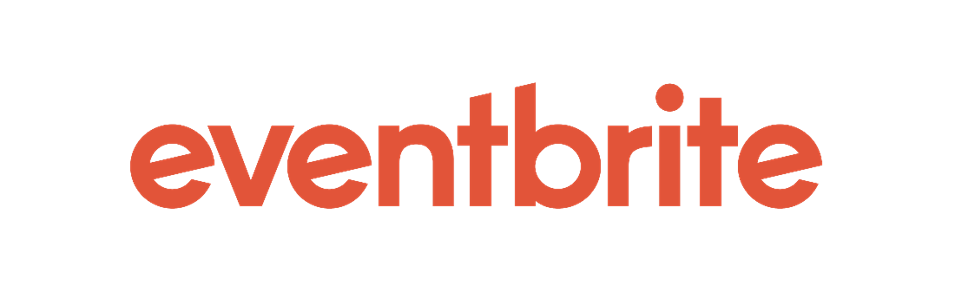

---

layout: col-sidebar
title: OWASP Montreal
tags: OWASPMTL
region: North America
meetup-group:
country: Canada
postal-code: H2Y 2H6
---

---
## Welcome / Bienvenue
Bienvenue sur la page d'accueil du Chapitre de Montréal.
 
Welcome to the Montreal Chapter Homepage.

## Participation
Nos réunions sont ouvertes au public et vous n'avez pas besoin d'être membre pour y assister. Merci d'envisager de [devenir membre OWASP](https://owasp.org/membership/) si vous trouvez notre communauté, nos projets et nos réunions utiles, ou si vous voulez parrainer ce chapitre.

Our meetings are open to the public and you do not need to be a member to attend. Please consider [becoming an OWASP member](https://owasp.org/membership/) if you find our community, projects and meetings useful, or if you want to sponsor this chapter.

Next Meeting/Event <!-- You should keep this section as it will populate your meetup events -->
---------------------


## Prochaine rencontre
 

### **Mercredi 4 Octobre 2023: Évenement réseautage OWASP MTL - OASIS SURF à Brossard**
Soirée de réseautage présenté par OWASP MTL X DESJARDINS. Conférence, surf, tapas et consommations gratuites!
 
 

**À propos de cet événement**
 
🌐 Rejoignez-nous pour une soirée inoubliable alliant Cybersécurité et Fun sur les Vagues ! 🏄‍♂️

Appel à tous les passionnés de la cybersécurité ! Rejoignez-nous pour une soirée riche en connaissances sur la cybersécurité, en réseautage, et une dose d'adrénaline alors que nous surfons sur les vagues.

🌊 Moments Forts de l'Événement 🌊

🔒 Rassemblement de la Communauté de la Cybersécurité : Connectez-vous avec vos collègues professionnels de la cybersécurité, partagez vos idées, et élargissez votre réseau dans une atmosphère détendue et dynamique.

🍹 Boissons et Tapas Offerts : Soyez parmi les 50 premiers à vous inscrire et recevez 2 boissons rafraîchissantes offertes en remerciement de votre engagement précoce à cet événement ! Dégustez une délicieuse sélection de tapas tout au long de la soirée, faisant de cet événement un véritable festin pour les sens.

🏄‍♂️ Expérience de Surf : Plongez dans l'excitation de la glisse sur les vagues avec 12 places disponibles pour une session de surf privée de 30 minutes. Accrochez-vous et chevauchez la vague d'excitation !

🎤 Conférence Spéciale : Explorez en profondeur le monde de la Modélisation des Menaces avec une présentation de 30 minutes par Léandre Forget-Besnard. Acquérez des connaissances précieuses pour identifier et atténuer les menaces en cybersécurité.

🤝 Sponsorisé par Desjardins : Nous sommes fiers d'avoir Desjardins comme sponsor, garantissant une expérience mémorable, fantastique et enrichissante pour tous les participants.

🎫 Billets : Cet événement est gratuit, mais les places sont limitées. Réservez votre place dès aujourd'hui pour faire partie de cette soirée inoubliable. Au cas où les billets seraient épuisés, n'hésitez pas à venir quand même, nous ne refuserons aucune entrée. Les 50 premiers inscrits seront simplement les seuls à recevoir 2 billets pour des boissons gratuites.

Ne manquez pas l'opportunité de combiner votre passion pour la cybersécurité avec l'excitation de la glisse sur les vagues. Rejoignez-nous à l'Oasis Surf Brossard le 4 octobre pour une soirée de réseautage, d'apprentissage, et de plaisir inoubliable.

Les vagues vous attendent, passionnés de cybersécurité ! Nous avons hâte de vous y voir. 🏄‍♀️🔒 #OWASPWaveEvent

**Date et heure:**
 
&nbsp;&nbsp;&nbsp;&nbsp;Mardi 4 Octobre 2023: &nbsp;&nbsp;&nbsp;17:00 – 21:00 PM HAE
 

**Lieu de la séance**
 
&nbsp;&nbsp;&nbsp;&nbsp;Centre Surf Inside Oasis Surf 
&nbsp;&nbsp;&nbsp;&nbsp;9520 Boulevard Leduc 
&nbsp;&nbsp;&nbsp;&nbsp;#Suite 01 
&nbsp;&nbsp;&nbsp;&nbsp;Brossard, QC, J4Y 0B3
 
 

**RSVP! Inscription gratuite (50 places de disponibles uniquement avec consommations incluses)**
 

 
 

---------------------

 

