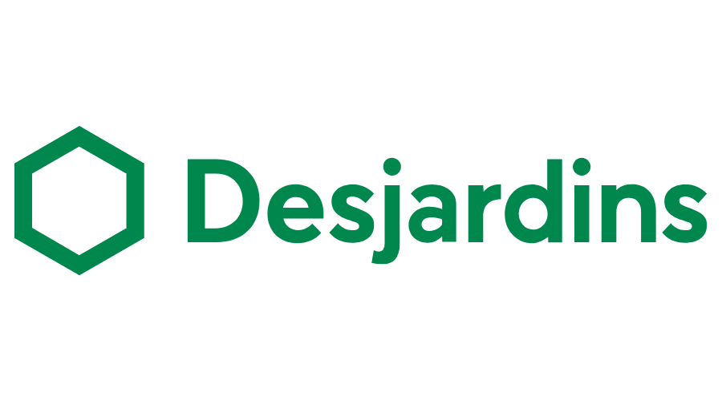

Partenaire - Platine
----------
Nous sommes reconnaissants pour le soutien de notre partenaire principal, Cybereco, dans notre chapitre local de Montréal.
We are grateful for the substantial support of our main partner, Cybereco, in our local Montreal chapter.

-------------------------------------------------------------------

Partenaires - Or
----------
Nous voudrions remercier les organisations suivantes pour leur support et
leur contribution au chapitre de Montréal\!

We would like to thank the following organizations for their support and
contribution to the local Montreal chapter\!

-------------------------------------------------------------------

<table class="sponsors-table">
    <tr>
        <td>  </td>
        <td>  </td>
    </tr>
    <!-- <tr>
        <td>  </td>
        <td>  </td>
        <td> <a href="https://www.cmd.com/"> _cmd" title=">_cmd"/> </a> </td>
    </tr> -->
</table>

---
